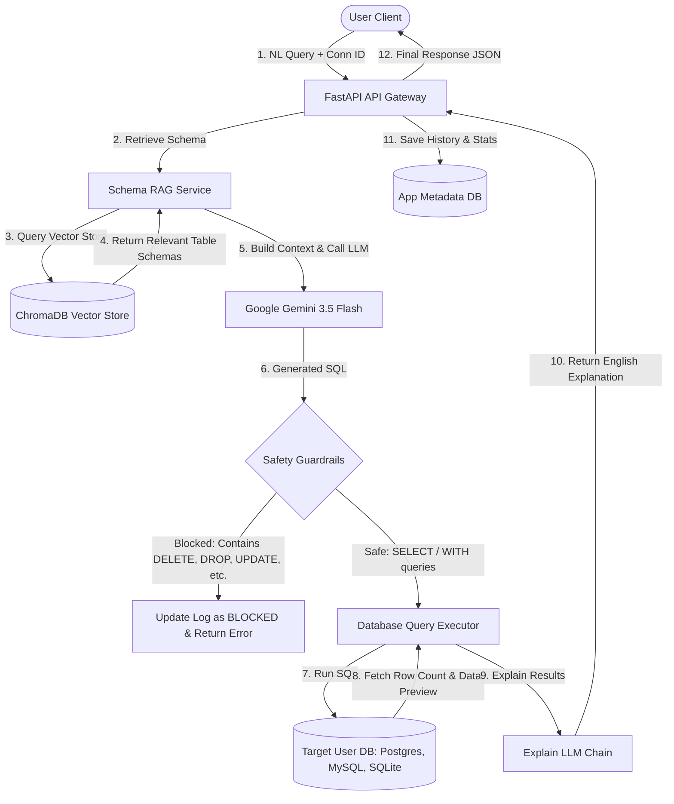

# 🤖 AI-Powered SQL Generator & Executor API

An enterprise-ready, secure, and production-grade FastAPI application that translates **Natural Language questions** into **safe SQL queries**, executes them against targeted user databases (PostgreSQL, MySQL, SQLite), retrieves the results, and uses Large Language Models (LLMs) to explain the output in plain English. 

The application utilizes **Retrieval-Augmented Generation (RAG)** via **ChromaDB** to locate relevant schema contexts dynamically, and incorporates strict security guardrails to block unauthorized or destructive database statements.

---

## 🗺️ System Architecture

The workflow below illustrates how a natural language question is processed, vectorized, validated, and executed:



---

## ✨ Key Features

- **🗣️ Natural Language to SQL**: Converts complex, multi-table queries from plain language into executable SQL statements customized for the target database dialect.
- **📚 Schema RAG (Retrieval-Augmented Generation)**: Dynamic indexing of database metadata (tables, columns, data types, primary keys, and sample data previews) into **ChromaDB** using **Gemini Embeddings**. Relevant contexts are dynamically injected into prompt windows to allow scaling to databases with hundreds of tables.
- **🛡️ Strict SQL Execution Guardrails**: Lexical and structural filtering ensuring **only read-only SELECT and WITH statements** are run. Destructive DDL/DML statements (e.g., `DELETE`, `DROP`, `UPDATE`, `ALTER`) are immediately intercepted and flagged as `BLOCKED`.
- **✍️ Plain-English Explanations**: Translates tabular result previews and the executed SQL back into clean, summaries for non-technical users.
- **📊 System Analytics & Diagnostics (Admins Only)**: 
  - Comprehensive metrics tracking average execution times, execution status ratios (Success, Failed, Blocked), and feedback patterns.
  - Identification of slow-running queries.
  - **AI Diagnostics Tool**: Recommends missing indexes (DDL generation) and query rewrites for optimized performance.
- **🔐 JWT-based Security**: Full authentication flow using FastAPI Security, OAuth2, and bcrypt password hashing.

---

## 🛠️ Technology Stack

- **Framework**: [FastAPI](https://fastapi.tiangolo.com/) (Python 3.11)
- **Database ORM**: [SQLAlchemy 2.0](https://www.sqlalchemy.org/)
- **Vector Database**: [ChromaDB](https://www.trychroma.com/) (For semantic schema retrieval)
- **LLM Provider**: [Google Gemini 3.5 Flash](https://deepmind.google/technologies/gemini/) (via `langchain-google-genai`)
- **Metadata Database**: PostgreSQL (Stores user accounts, connection parameters, and query execution history)
- **Containerization**: Docker & Docker Compose

---

## ⚙️ Environment Configuration

Copy the `env.example` file to create your own configuration:
```bash
cp env.example .env
```

Ensure the following variables are set:

| Variable | Description | Example / Default |
| :--- | :--- | :--- |
| `DATABASE_HOSTNAME` | Database container name / host | `db` (or `localhost`) |
| `DATABASE_PORT` | Port of application PostgreSQL database | `5432` |
| `DATABASE_NAME` | Database name for metadata storage | `ai_powered_sql` |
| `DATABASE_USERNAME` | Username for metadata database | `postgres` |
| `DATABASE_PASSWORD` | Password for metadata database | `postgres` |
| `SECRET_KEY` | JWT signing key (change in production) | `generate_a_secure_random_key_here` |
| `ALGORITHM` | Hashing algorithm | `HS256` |
| `ACCESS_TOKEN_EXPIRE_MINUTES` | Expiration limit of JWT token | `60` |
| `GOOGLE_API_KEY` | Google AI Studio Developer Key | `your_gemini_api_key_here` |
| `GEMINI_MODEL` | Gemini LLM used for SQL & explanations | `models/gemini-3.5-flash` |
| `GEMINI_EMBEDDING_MODEL` | Embedding model for ChromaDB | `models/gemini-embedding-001` |
| `CHROMA_PERSIST_DIR` | Directory to persist vector data | `/app/chroma_db` (or local path) |

---

## 🚀 Quick Start Guide

### Option A: Running with Docker Compose (Recommended)

Docker Compose automatically provisions PostgreSQL, initializes the database tables, configures ChromaDB, and spins up the FastAPI web container.

1. Ensure Docker is running.
2. Edit the `.env` file or modify the credentials in `docker-compose.yml`.
3. Launch the environment:
   ```bash
   docker-compose up --build -d
   ```
4. Access the interactive API documentation at: [http://localhost:8000/docs](http://localhost:8000/docs)

### Option B: Local Development Setup

If you prefer to run the FastAPI app directly on your local system:

1. **Create and Activate virtual environment**:
   ```bash
   python -m venv venv
   # On Windows (PowerShell)
   .\venv\Scripts\Activate.ps1
   # On macOS/Linux
   source venv/bin/activate
   ```

2. **Install system packages & python dependencies**:
   Ensure you have PostgreSQL clients/libraries installed on your system, then run:
   ```bash
   pip install -r requirements.txt
   ```

3. **Configure Environment**:
   Ensure you run a local PostgreSQL instance matching the connection settings in your `.env` file.

4. **Launch the FastAPI Server**:
   ```bash
   uvicorn app.main:app --reload --host 127.0.0.1 --port 8000
   ```

---

## 📌 API Endpoint Reference

Detailed documentation is available at `/docs` (Swagger UI) or `/redoc`. Below are the primary routes:

### 🔑 Authentication & Users
- `POST /auth/register` - Create a new user account.
- `POST /auth/login` - Login to receive an OAuth2 JWT Access Token.
- `GET /users/me` - Retrieve the current user's profile details.

### 🔌 Database Connections
- `POST /connections/` - Register a database connection (stores `postgresql`, `mysql`, or `sqlite` configuration strings).
- `GET /connections/` - List registered database connections owned by the active user.
- `DELETE /connections/{connection_id}` - Delete a registered connection.
- `POST /connections/{connection_id}/sync` - Inspect the target database schema dynamically, generate documentation definitions, and **index them in ChromaDB** for RAG.
- `GET /connections/{connection_id}/schema` - View cached schema objects for the database.

### 💬 Queries & Execution
- `POST /queries/{connection_id}/execute` - Translate natural language question into SQL, validate safety constraints, execute it, write an explanation, and save historical log.
- `GET /queries/{connection_id}/history` - Retrieve execution logs, status, SQL commands, and AI explanations for a connection.
- `PATCH /queries/{query_id}/feedback` - Update user feedback status (`thumbs_up`, `thumbs_down`, `none`) on generated queries for metrics calibration.

### 🛡️ Admin & Diagnostic Operations (Requires Admin Role)
- `GET /admin/analytics` - View query velocity metrics, aggregate counts of successful/failed/blocked operations, user feedback ratios, and slow-running queries.
- `POST /admin/optimize/{query_id}` - Diagnose a slow or failed SQL statement by ID. The LLM evaluates execution stats and returns index suggestions (`CREATE INDEX` commands) and optimized query rewrites.

---

## 🔒 Security Design & Guardrails

To prevent SQL Injection and unauthorized destructive commands (such as data truncation or system access), the API enforces the following boundaries:

1. **Strict SQL Parser Filter**: Every generated query passes through a validation middleware (`is_sql_safe`).
   - Rejects any query containing `DROP`, `DELETE`, `UPDATE`, `INSERT`, `ALTER`, `TRUNCATE`, `CREATE`, `GRANT`, `REVOKE`.
   - Strips single-line (`--`) and multi-line (`/* ... */`) SQL comments before analysis to prevent filter bypass strategies.
   - Enforces that the statement must strictly start with `SELECT` or `WITH`.
2. **Dialect Matching**: Uses SQLAlchemy's dialect-safe execution parameterization when mapping query arguments.
3. **User Separation**: Users can only execute queries against connections they registered or are explicitly authorized to access. Admin resources are strictly locked behind claims validation.

---

## 🧪 Testing the API

You can test the system manually using the Swagger panel (`/docs`).

1. Register an account (`POST /auth/register`).
2. Login and copy the token (`POST /auth/login`). Authorize yourself in the Swagger UI.
3. Register a connection (`POST /connections/`). For testing, you can use the bundled sqlite database by passing `sqlite:///test_employees.db` as the connection string.
4. Sync the connection schema (`POST /connections/{connection_id}/sync`) to index tables into ChromaDB.
5. Ask a question (`POST /queries/{connection_id}/execute`):
   ```json
   {
     "nl_query": "Show me the top 3 employees with the highest salary in the marketing department."
   }
   ```
6. Inspect the generated query, result preview, and the generated English explanation!
